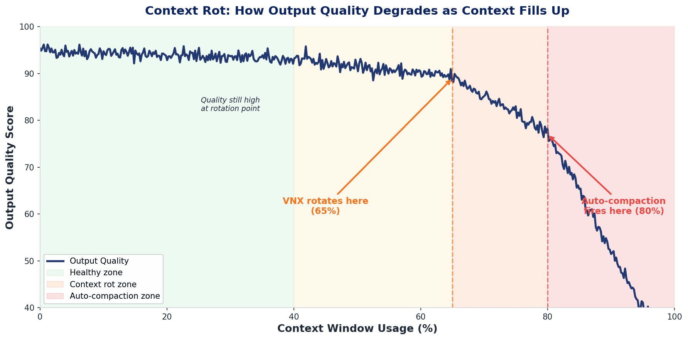

# Domain Expert Installer — Claude Code Plugin

A one-time installer that gives any repo a persistent, **hook-enforced** domain knowledge system.
Every agent that opens the repo automatically reads accumulated domain knowledge at session start,
and is prompted to contribute back after meaningful work — *before context degrades*.

Distributed as a standalone Claude Code plugin. Add the marketplace, install the plugin, then run
the installer once inside any repo you want instrumented.

---

## The Problem: Agents Forget Everything

Every time an agent session starts, it begins with zero memory of prior sessions. It rediscovers the
same non-obvious facts over and over:

- Which service actually owns this flow (not the one that looks like it does)
- The hidden coupling between two modules that cost 30 minutes to find last time
- The constraint that isn't in the code but is buried in a PR from eight months ago
- The three files you have to update together or nothing works

This rediscovery isn't free. It costs tokens — often hundreds of thousands — just to get an agent
back to the same starting point a previous session already reached. In a long-running project this
compounds into a tax on every task.

---

## Context Rot: Why Timing Matters

Even within a single session, quality degrades as the context window fills up.



*Image credit: [Vincent van de Ven — "Context Rot & Claude Code Automatic Rotation"](https://vincentvandeth.nl/blog/context-rot-claude-code-automatic-rotation).*

- **Healthy zone (0–65%)** — output quality is stable and high.
- **Context rot zone (65–80%)** — the agent works with an increasingly compressed view of its own
  prior reasoning; early insights become harder to surface accurately.
- **Auto-compaction zone (80%+)** — the runtime compacts the context automatically. This is lossy:
  detail is traded for space, and the agent is no longer a reliable narrator of what it discovered.

The implication: **if you want an agent to accurately capture what it learned, you must ask before
context rot sets in.** A retrospective prompt at 90% full is nearly useless. One at 65% is crisp.

---

## The Solution: Cross-Agent Memory via `expert/`

The system gives agents a shared, persistent memory store — a folder of markdown files that survive
across sessions, agents, and engineers.

1. **Reading is mandatory and free.** `expert/index.md` is injected as a system-reminder at every
   session start via a hook — not a soft directive. Agents can't skip it.
2. **Writing is gated.** Before any write to an `expert/*.md` file, a quality gate fires. The agent
   must pass a three-question challenge: one grep? multiple files? stable across tasks? Trivial
   facts are blocked before they land on disk.
3. **Retrospectives fire at the right moment.** A retrospective nudge triggers when context hits
   ~65% — inside the healthy zone. If a commit happens first, the commit hook fires instead.
4. **Compaction is detected and respected.** If auto-compaction fires, both retrospective hooks
   stand down — a compacted context is an unreliable source for expert knowledge.

### Quality bar

An insight belongs in an expert file if and only if it is all three of:

- **Non-obvious** — a future agent would have to explore to find it
- **Multi-file** — it cannot be understood from a single read or grep
- **Stable** — it will remain true and useful across different future tasks

---

## The Hooks

The installer wires five Claude Code hooks and one git hook.

| Hook | Event | Job |
| --- | --- | --- |
| `session-start-expert.sh` | SessionStart (`startup`, `resume`) | Injects `expert/index.md` as a system-reminder. |
| `expert-gate.sh` | PreToolUse (`Write\|Edit\|MultiEdit`) | Injects the quality challenge for writes to `expert/*.md`; silent otherwise. |
| `session-compact-expert.sh` | PostCompact | Marks the session as compacted; retro hooks then stand down. |
| `session-monitor-expert.sh` | PostToolUse | Fires the 65%-context retrospective nudge, once per session. |
| `session-stop-expert.sh` | PostToolUse (`Bash`) | Fires a retrospective after a commit (via the git marker). |
| `.git/hooks/post-commit` | git | Writes a repo-scoped marker after every commit (Claude's or the developer's). |

### Hook decision logic

```
After every tool use (PostToolUse):
  Was context compacted this session?  → yes: do nothing
  Is context ≥ 65% used?
    Already fired this session?        → yes: do nothing
                                       → no:  fire retrospective nudge, mark as fired

After every Bash call (PostToolUse: Bash):
  Was a commit just made?              → no:  do nothing
  Was context compacted this session?  → yes: consume marker, do nothing
  Did the 65% retro already fire?      → yes: consume marker, do nothing
                                       → no:  consume marker, fire retrospective

Before any Write/Edit/MultiEdit (PreToolUse):
  Is the target file under expert/?    → no:  do nothing
                                       → yes: inject quality gate challenge
```

---

## Installation

### Step 1 — Add the marketplace (once per machine)

```
/plugin marketplace add auval/ai-expert-skill
```

### Step 2 — Install the installer plugin

```
/plugin install domain-expert-installer@auval-plugins
```

### Step 3 — Run the installer inside a repo

Open Claude Code in the repo you want instrumented and ask it to run the installer:

```
Use the domain-expert-installer skill to set up the domain-expert system in this repo.
```

The skill creates `expert/index.md`, writes and wires the hooks, and verifies the install. When it
finishes, **restart your Claude Code session** (or run `/hooks`) so the newly wired hooks load.

> The installer writes files *into the current repo* — it does not touch the user-level agent
> directory. Run it from the root of each repo you want instrumented.

### What gets created in the target repo

```
<repo>/
├── expert/
│   └── index.md                          # domain knowledge index (template)
├── .claude/
│   ├── hooks/
│   │   ├── session-start-expert.sh       # SessionStart: inject expert/index.md
│   │   ├── expert-gate.sh                # PreToolUse: quality gate for expert writes
│   │   ├── session-compact-expert.sh     # PostCompact: mark session as compacted
│   │   ├── session-monitor-expert.sh     # PostToolUse: 65% context retro
│   │   └── session-stop-expert.sh        # PostToolUse/Bash: post-commit retro
│   └── settings.json                     # hook wiring
└── .git/
    └── hooks/
        └── post-commit                   # writes commit marker (not tracked by git)
```

### Upgrade path

If the repo previously used a soft-directive version (a "read `expert/index.md`" block in
`CLAUDE.md`/`AGENTS.md`), the installer detects and removes those directives — the hooks enforce the
same behaviour structurally, so the soft directives become redundant noise.

---

## Token Economics

Reading `expert/index.md` at session start costs a few hundred tokens. Avoiding the re-exploration
of a non-obvious domain saves tens of thousands. In a codebase with active expert files the ROI
compounds — each agent's discoveries become available to every future agent. The quality gate keeps
the signal-to-noise ratio high, which preserves the economics of the read side.

---

## Repo layout (this plugin)

```
ai-expert-skill/
├── .claude-plugin/
│   ├── marketplace.json                  # marketplace: auval-plugins
│   └── plugin.json                       # plugin: domain-expert-installer
├── skills/
│   └── domain-expert-installer/
│       └── SKILL.md                      # the installer skill (self-contained)
├── context_rot.png
└── README.md
```

## License

Apache 2.0
